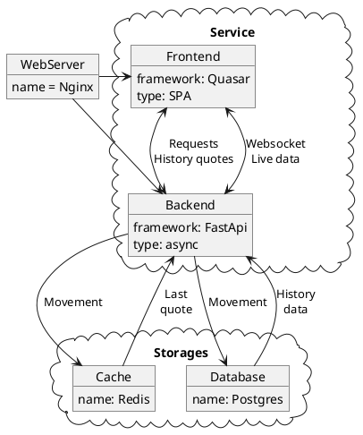

Сервис состоит из двух частей:
- Backend, написан на python на фреймворке [FastApi](https://fastapi.tiangolo.com/) .
- Frontend, написан на typescript как SPA на фреймворке [Quasar](https://quasar.dev/) с Vue под капотом.

В целом структуру приложения можно представить в следующем виде:

В качестве БД, для хранения исторических данных, использована база данных Postgres.
Redis использовался для хранения текущих котировок и быстрой генерации live данных для frontend.
Для будущего распределения нагрузки frontend и backend прикрыты nginx.
За работоспособность backend отвечает supervisor, использованный в качестве менеджера процессов.
